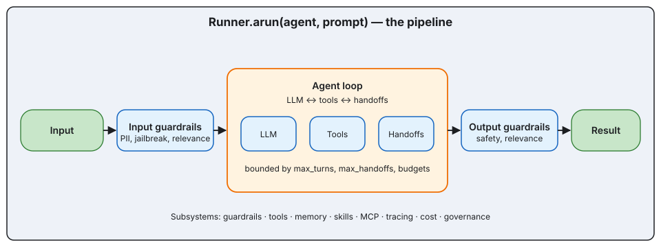

# Architecture

> How the ADK fits together: the pipeline, the three type layers, the
> Runner loop, the LLM ABC, and the multi-agent composition primitives.

*The big-picture pipeline. Every `Runner.arun(...)` call traverses this shape.*

- **[Overview](overview.md)** — The five-stage pipeline and where each subsystem plugs in.
- **[Type layers](type-layers.md)** — `LLMInputContentItem` (Layer 1), `ChatCompletion*` (Layer 2 wire), `RunItem` (Layer 3 developer-facing).
- **[Runner](runner.md)** — The agent loop, `max_turns`, retries, streaming.
- **[LLM ABC](llm-abc.md)** — Framework-owned `LLM`, not OpenAI's `Model`. One conversion per direction inside each provider.
- **[Handoffs & Swarms](handoffs-and-swarms.md)** — Routing and iterative collaboration.
- **[Graphs](graphs.md)** — State-machine orchestration with checkpointers and HITL.
- **[Governance](governance.md)** — Tenant routing, allowlists, audit, cost ledger.
